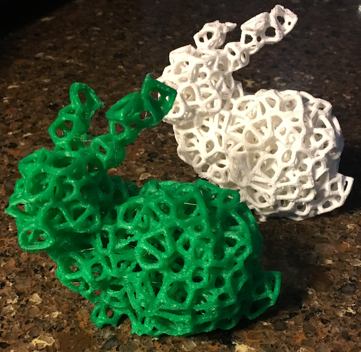

This project is based off [the Voro++ project](http://math.lbl.gov/voro++/). That code was modified and extended to take an input STL and generate an output STL which is the same form as the input STL, but filled with a cellular voronoi pattern. This code runs on linux (Ubuntu and RPI4) and used to work on MacOS

For more information about running the script, see sw/readme.txt

For example, for this input STL (in examples/bunny.stl),
```
ViewSTL examples/bunny.stl
```


The rendered output STL,
```
ViewSTL sw/out.stl-0.stl
```


Using 'ViewSTL' (provided in this project) to view both input and output STL at the same time,
```
ViewSTL examples/bunny.stl sw/out.stl-0.stl
```


Then you print that output STL for fun!


