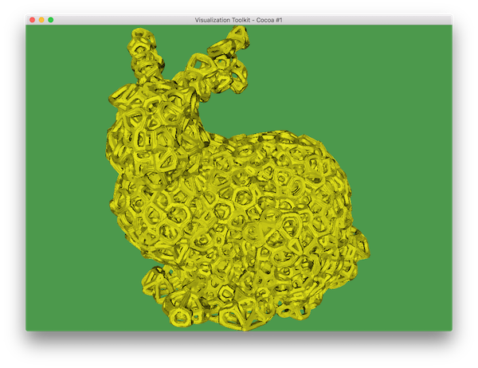

This project uses an input STL to generate an output STL which is the same form as the input STL, but filled with a cellular voronoi pattern.

For more information, see the sw/readme.txt

For example, for this input STL (in examples/bunny.stl),

The rendered output STL,

Using 'ViewSTL' (provided in this project) to view both input and output STL at the same time,

